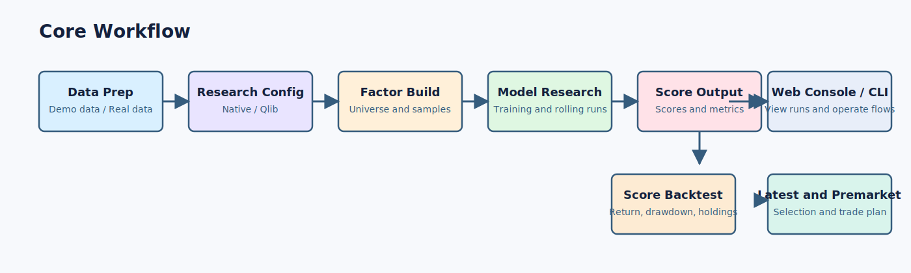

# A Share Quant Research Workspace

[中文说明](README.md)

Full usage guide: [Documentation](https://cyecho-io.github.io/ashare-lowfreq-research/).

This repository is a local A-share quant research workspace for individual researchers. It supports native and qlib research pipelines, score backtests, a local web console, and simulation-oriented downstream workflows.

## Core Workflow



## What The Project Can Do Today

The repository is no longer just a small backtest utility. It now provides a local end-to-end workflow with:

- a web-first entry point for research, backtest, and simulation tasks
- native and qlib research pipelines that both produce downstream-compatible `scores.parquet`
- workspace isolation for `native` and `qlib` runs, score files, backtests, and simulation outputs
- bundled demo data, including project parquet data and a tiny qlib provider
- a real-data path based on Tushare sync to SQLite and import into project parquet storage
- preserved research artifacts such as config snapshots, logs, metrics, layer analysis, and backtest results
- one local loop spanning research, score backtests, latest inference, premarket references, and simulation entry points

## Current Scope

This project is intentionally scoped:

- Market: mainland China A-shares
- Frequency: daily bars
- Strategy shape: long-only stock portfolios
- Research loop: factor build -> model training -> walk-forward / latest inference -> score backtest
- Execution controls: commission, stamp tax, slippage, participation cap, and pending-order handling
- Interfaces: CLI plus a local web console

Out of scope for now:

- a general multi-asset quant platform
- intraday or tick-level simulation
- derivatives, margin, or complex account systems
- unrestricted arbitrary Python strategy execution
- distributed scheduling or multi-tenant infrastructure

## Installation

Requires Python 3.11+.

```bash
python -m pip install -e ".[dev]"
```

This exposes:

- `ashare-backtest`
- `ashare-backtest-web`

Copy the environment template first:

```bash
cp .env.example .env
```

You only need `TUSHARE_TOKEN` when syncing real market data.

If you want to use the qlib research path, also install:

```bash
python -m pip install -e ".[qlib]"
```

See [docs/qlib-integration.md](docs/qlib-integration.md) for more detail.

## Quick Demo

For a first-time clone, the recommended path is the bundled web-first demo flow.

### 1. Bootstrap the environment

```bash
bash scripts/bootstrap_demo.sh
source .venv/bin/activate
```

Install qlib if you want to try the qlib workspace:

```bash
python -m pip install -e ".[qlib]"
```

### 2. Start the local web console

```bash
ashare-backtest-web
```

Open:

```text
http://127.0.0.1:8888
```

### 3. Try both qlib and native workspaces

The repository ships with a tiny dataset under `storage/demo/`, including:

- project parquet data
- a tiny qlib provider

So a first-time user can try both pipelines without a Tushare token or a private market-data setup.

Recommended order:

1. Open `/research`
2. Switch workspace to `qlib` and run `demo strategy`
3. Open `/backtest` and run a backtest from the generated qlib scores
4. Switch workspace to `native` and run the native demo config
5. Open `/backtest` again and inspect the native backtest result

Default demo outputs are written to:

- `research/qlib/demo/`
- `research/native/demo/`
- `results/qlib/demo_backtest/`
- `results/native/demo_backtest/`

CLI users can run:

```bash
ashare-backtest run-research-config configs/qlib/demo_strategy.toml
ashare-backtest run-research-config configs/native/demo_strategy.toml
```

See the full walkthrough in [Quickstart](https://cyecho-io.github.io/ashare-lowfreq-research/quickstart/).

## Using Real Data

To switch from demo data to your own data, the recommended order is:

1. sync Tushare data into SQLite
2. import SQLite into parquet storage
3. update `[storage].root` in your research config
4. if using qlib, update `[qlib].provider_uri` and `[qlib].market`

### Sync SQLite data

```bash
ashare-backtest sync-tushare-sqlite \
  --sqlite-path storage/source/ashare_arena_sync.db \
  --start 20240101 \
  --end 20260331
```

If you also want benchmark history:

```bash
ashare-backtest sync-tushare-benchmark \
  --symbol 000300.SH \
  --start 20240101 \
  --end 20260331
```

### Import into parquet storage

```bash
ashare-backtest import-sqlite storage/source/ashare_arena_sync.db --storage-root storage
```

### Run research and backtest

```bash
ashare-backtest run-research-config configs/qlib/research_industry_v4_v1_1_qlib.toml
```

```bash
ashare-backtest run-model-backtest \
  --scores-path research/qlib/demo/models/demo_scores.parquet \
  --storage-root storage/demo \
  --start-date 2025-01-02 \
  --end-date 2026-02-27 \
  --output-dir results/qlib/demo_backtest_manual
```

See [Real Data Setup](https://cyecho-io.github.io/ashare-lowfreq-research/real-data/) for the full path.

## Web Console

Start it with:

```bash
ashare-backtest-web
```

The console currently provides four main pages:

- `/`: dashboard for data readiness, recent runs, and workspace summaries
- `/research`: research console for editing `configs/**/*.toml` and running full research pipelines
- `/backtest`: backtest console for selecting score files, date ranges, and result labels
- `/simulation`: simulation console for account state, execution history, and downstream entry points

All pages share the top-level workspace switcher and automatically scope:

- config candidates
- research runs
- score files and lineage
- backtest result folders
- simulation outputs

## Useful CLI Commands

The repository also exposes standalone CLI entry points:

- `ashare-backtest sync-tushare-sqlite`
- `ashare-backtest sync-tushare-benchmark`
- `ashare-backtest import-sqlite`
- `ashare-backtest build-factors`
- `ashare-backtest run-research-config`
- `ashare-backtest run-model-backtest`
- `ashare-backtest qlib-train-walk-forward`
- `ashare-backtest qlib-train-as-of-date`
- `ashare-backtest qlib-train-single-date`

If you prefer command-line usage, see the docs page for [CLI Mapping](https://cyecho-io.github.io/ashare-lowfreq-research/cli-reference/).

## Repository Layout

- `configs/`: runnable research and backtest configs
- `configs/native/`: native pipeline configs
- `configs/qlib/`: qlib pipeline configs
- `docs-site/`: GitHub Pages source files
- `docs/`: supplementary design and research notes
- `scripts/`: demo bootstrap and helper scripts
- `src/ashare_backtest/`: core Python package
- `src/ashare_backtest/web/`: local web console
- `storage/`: project parquet data, source SQLite, and demo data
- `tests/`: regression tests

Generated artifacts usually live under `research/` and `results/` and are meant for local research workflows.

## Related Docs

- [Documentation Home](https://cyecho-io.github.io/ashare-lowfreq-research/)
- [Quickstart](https://cyecho-io.github.io/ashare-lowfreq-research/quickstart/)
- [Web Console](https://cyecho-io.github.io/ashare-lowfreq-research/web-console/)
- [CLI Mapping](https://cyecho-io.github.io/ashare-lowfreq-research/cli-reference/)
- [Demo Data](https://cyecho-io.github.io/ashare-lowfreq-research/demo-data/)
- [Real Data Setup](https://cyecho-io.github.io/ashare-lowfreq-research/real-data/)
- [Qlib Integration](docs/qlib-integration.md)
- [Demo Data Notes](storage/demo/README.md)

## Testing

```bash
python -m pip install -e ".[dev]"
python3 -m pytest
```
