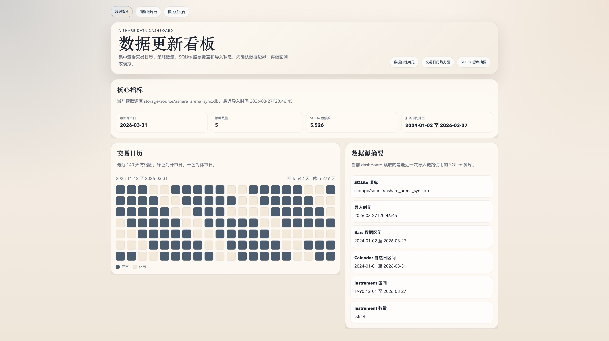
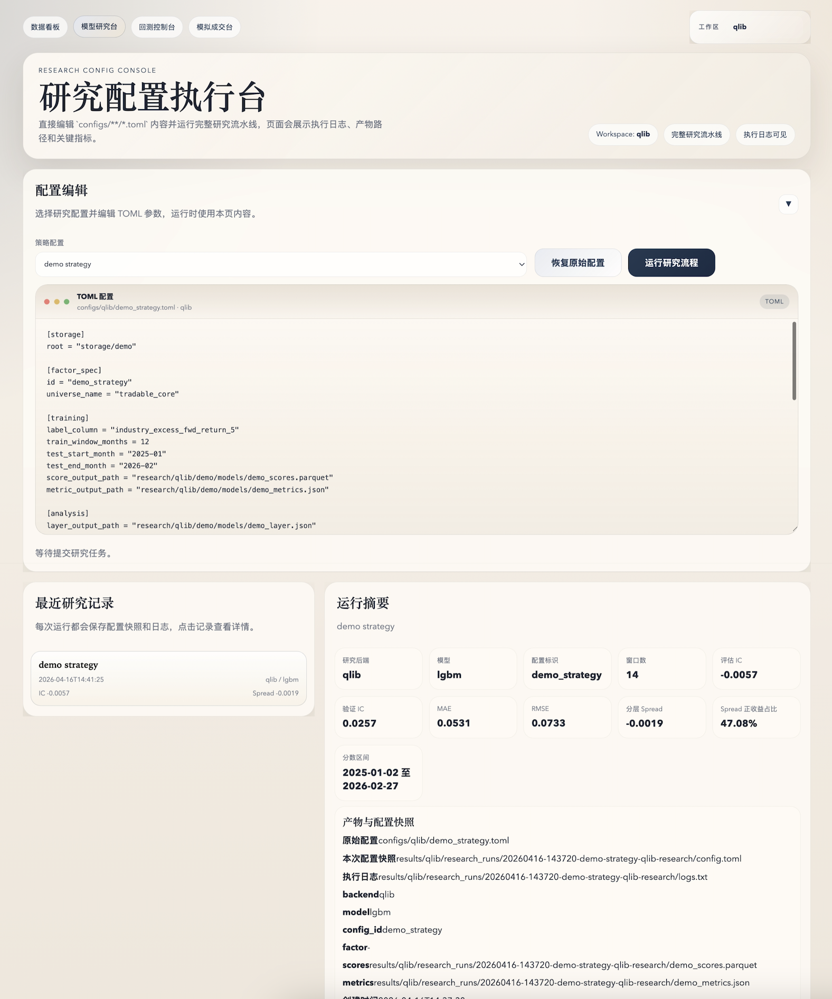
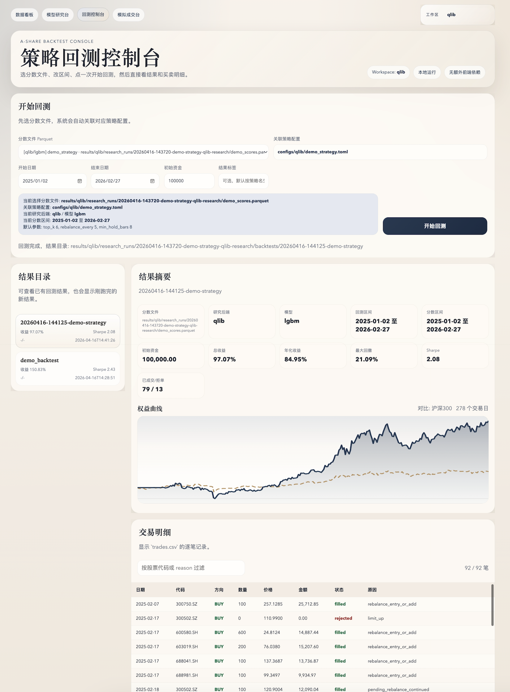
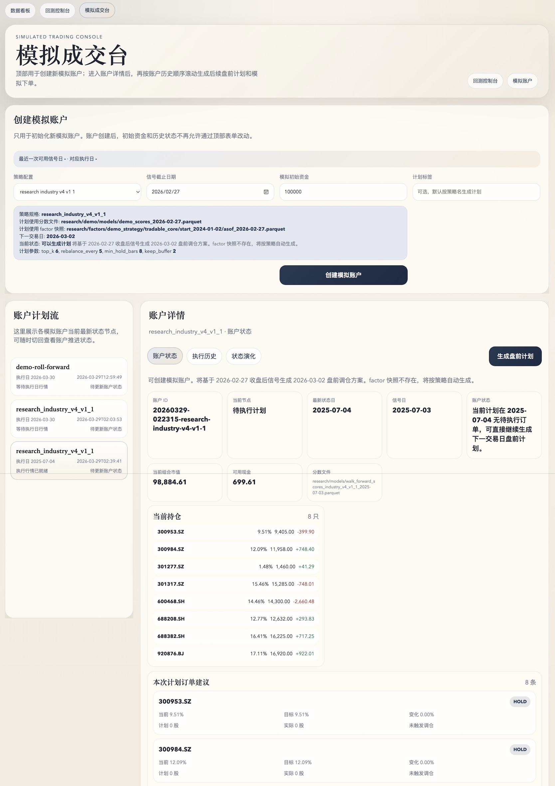

# A Share Quant Research Workspace

[English README](README.en.md)

完整使用指南见：[文档站](https://cyecho-io.github.io/ashare-lowfreq-research/)。

这是一个面向个人研究场景的 A 股低频量化研究工作台，支持 qlib 与 native 双链路的模型研究、分数回测、本地 Web 控制台和模拟执行工作流。

## 核心流程


## 当前项目能力

当前仓库已经不是单一的“回测脚本集合”，而是一条可落地、可重复运行的本地研究链路，重点能力包括：

- `Web 优先` 的体验入口：推荐先打开本地控制台，再运行研究、回测和模拟
- `native / qlib` 双研究链路：两条链路都能产出兼容下游的 `scores.parquet`
- `workspace` 隔离：`native` 与 `qlib` 的研究记录、分数文件、回测结果和模拟结果分开管理
- `demo 数据内置`：仓库自带极小 Parquet 数据和小型 qlib provider，首次 clone 后可直接体验两条链路
- `真实数据接入`：支持通过 Tushare 同步 SQLite，再导入为项目使用的 Parquet 存储
- `研究工件可追溯`：研究配置快照、执行日志、metrics、layer analysis、回测结果都能在本地保留并在 Web 页面查看
- `下游闭环`：模型研究、分数回测、盘前参考、策略状态和模拟执行共用一套本地数据与产物约定

如果你想快速理解项目，建议把它看成一个面向个人研究者的本地 research workspace，而不是一个单点 backtest utility。

## 当前边界

这个项目是有边界的，当前聚焦在下面这条问题空间：

- 市场：A 股
- 频率：日线
- 策略形态：多头股票组合
- 研究方式：因子构建 -> 模型训练 -> walk-forward / latest inference -> score backtest
- 执行约束：手续费、印花税、滑点、成交参与率上限、挂单保留天数
- 使用方式：CLI + 本地 Web 控制台


## 页面截图

<details>
  <summary>首页</summary>

  
</details>

<details>
  <summary>模型研究台</summary>

  
</details>

<details>
  <summary>回测控制台</summary>

  
</details>

<details>
  <summary>模拟成交台</summary>

  
</details>

## 安装

需要 Python 3.11+。

```bash
python -m pip install -e ".[dev]"
```

安装后会暴露两个命令：

- `ashare-backtest`
- `ashare-backtest-web`

建议先复制环境变量模板：

```bash
cp .env.example .env
```

只有在接入真实 Tushare 数据时，才需要填写 `TUSHARE_TOKEN`。

如果你准备使用 qlib 研究链路，再额外安装：

```bash
python -m pip install -e ".[qlib]"
```

补充说明见：[docs/qlib-integration.md](docs/qlib-integration.md)。

## 快速体验

如果你是第一次 clone 仓库，推荐直接走 `Web 优先` 的 demo 路径。

### 1. 初始化环境

```bash
bash scripts/bootstrap_demo.sh
source .venv/bin/activate
```

如果你要体验 qlib 链路，再安装 qlib 可选依赖：

```bash
python -m pip install -e ".[qlib]"
```

### 2. 启动本地 Web 控制台

```bash
ashare-backtest-web
```

打开：

```text
http://127.0.0.1:8888
```

### 3. 体验 qlib 与 native 两条链路

仓库已经内置 `storage/demo/` 小型 demo 数据源，其中同时包含：

- 项目标准 Parquet 数据
- 小型 qlib provider

因此第一次 clone 后，无需 Tushare token、无需私有数据源，也能体验两条链路。

推荐操作顺序：

1. 进入 `/research`
2. 把 workspace 切到 `qlib`，运行 `demo strategy`
3. 进入 `/backtest`，直接使用生成的 qlib 分数文件发起回测
4. 再把 workspace 切到 `native`，运行 native demo 配置
5. 再次进入 `/backtest`，查看 native demo 的回测结果

默认 demo 产物会写到：

- `research/qlib/demo/`
- `research/native/demo/`
- `results/qlib/demo_backtest/`
- `results/native/demo_backtest/`

命令行用户也可以直接运行：

```bash
ashare-backtest run-research-config configs/qlib/demo_strategy.toml
ashare-backtest run-research-config configs/native/demo_strategy.toml
```

更完整的首次体验说明见：[快速体验](https://cyecho-io.github.io/ashare-lowfreq-research/quickstart/)。

## 接入真实数据

如果你要从 demo 数据切换到自己的数据源，推荐顺序如下：

1. 同步 Tushare 到 SQLite
2. 把 SQLite 导入为 Parquet
3. 把研究配置里的 `[storage].root` 改成你的数据目录
4. 如果使用 qlib，再把 `[qlib].provider_uri` 和 `[qlib].market` 改成你自己的 provider

### 1. 同步 SQLite 数据

```bash
ashare-backtest sync-tushare-sqlite \
  --sqlite-path storage/source/ashare_arena_sync.db \
  --start 20240101 \
  --end 20260331
```

如果还要补齐基准指数：

```bash
ashare-backtest sync-tushare-benchmark \
  --symbol 000300.SH \
  --start 20240101 \
  --end 20260331
```

### 2. 导入为 Parquet

```bash
ashare-backtest import-sqlite storage/source/ashare_arena_sync.db --storage-root storage
```

### 3. 运行研究与回测

```bash
ashare-backtest run-research-config configs/qlib/research_industry_v4_v1_1_qlib.toml
```

```bash
ashare-backtest run-model-backtest \
  --scores-path research/qlib/demo/models/demo_scores.parquet \
  --storage-root storage/demo \
  --start-date 2025-01-02 \
  --end-date 2026-02-27 \
  --output-dir results/qlib/demo_backtest_manual
```

真实数据接入说明见：[接入真实数据](https://cyecho-io.github.io/ashare-lowfreq-research/real-data/)。

## Web 控制台

启动方式：

```bash
ashare-backtest-web
```

当前控制台包含四个主要页面：

- `/`：数据看板，查看数据状态、最近运行记录和 workspace 摘要
- `/research`：模型研究台，编辑 `configs/**/*.toml` 并运行完整研究流水线
- `/backtest`：回测控制台，选择分数文件、回测区间和结果标签后直接运行
- `/simulation`：模拟成交台，查看账户状态、执行历史和后续盘前入口

四个页面共享顶部 `工作区` 切换器，会按当前 workspace 自动切换：

- 研究配置候选
- 最近研究记录
- 分数文件与 lineage
- 回测结果目录
- 模拟执行结果

## 常用 CLI 能力

除了 Web 页面，当前项目也提供一组可单独运行的命令行入口：

- `ashare-backtest sync-tushare-sqlite`
- `ashare-backtest sync-tushare-benchmark`
- `ashare-backtest import-sqlite`
- `ashare-backtest build-factors`
- `ashare-backtest run-research-config`
- `ashare-backtest run-model-backtest`
- `ashare-backtest qlib-train-walk-forward`
- `ashare-backtest qlib-train-as-of-date`
- `ashare-backtest qlib-train-single-date`

如果你更习惯命令行，可以直接查看文档站里的 [CLI 对照](https://cyecho-io.github.io/ashare-lowfreq-research/cli-reference/)。

## 仓库结构

- `configs/`：可直接运行的研究与回测配置
- `configs/native/`：native 链路配置
- `configs/qlib/`：qlib 链路配置
- `docs-site/`：GitHub Pages 文档站源文件
- `docs/`：补充设计文档与研究说明
- `scripts/`：demo 初始化和辅助脚本
- `src/ashare_backtest/`：核心 Python 包
- `src/ashare_backtest/web/`：本地 Web 控制台
- `storage/`：项目 Parquet 数据、源 SQLite 和 demo 数据
- `tests/`：回归测试

生成产物默认位于 `research/`、`results/` 等目录下，这些目录主要用于本地研究与验证。

## 相关文档

- [文档站首页](https://cyecho-io.github.io/ashare-lowfreq-research/)
- [快速体验](https://cyecho-io.github.io/ashare-lowfreq-research/quickstart/)
- [Web 控制台](https://cyecho-io.github.io/ashare-lowfreq-research/web-console/)
- [CLI 对照](https://cyecho-io.github.io/ashare-lowfreq-research/cli-reference/)
- [Demo 数据](https://cyecho-io.github.io/ashare-lowfreq-research/demo-data/)
- [接入真实数据](https://cyecho-io.github.io/ashare-lowfreq-research/real-data/)
- [Qlib 集成说明](docs/qlib-integration.md)
- [Demo 数据说明](storage/demo/README.md)

## 测试

```bash
python -m pip install -e ".[dev]"
python3 -m pytest
```
